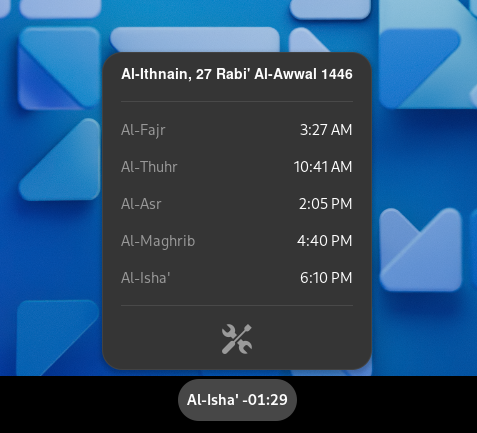

    بسم الله الرحمن الرحيم

# athan-gnome-shell-extension

A GNOME Shell extension for prayer preparation, athan times notification, and Hijri date displaying as well; all in the in your Linux GNOME shell system tray.

This is a modified fork off of the original by [fahrinh](https://github.com/fahrinh/azan-gnome-shell-extension), if it wasn't actually someone else, and lots of other people in between too! May Allah accept from us all, aameen.

### Why do we pray?

- "بيْنَ الرَّجُلِ وبيْنَ **الشِّرْكِ وَالْكُفْرِ تَرْكُ الصَّلَاةِ**"
- "استَقيموا ولَن تُحصوا ، **واعلَموا أنَّ خيرَ أعمالِكُمُ الصَّلاةَ** ، ولا يحافظُ علَى الوضوءِ إلَّا مؤمنٌ"
- "**أولُ ما يحاسبُ بهِ العبدُ يومَ القيامةِ الصَّلاةُ** ، فإنْ صَلَحَتْ ، صَلَحَ سائِرُ عَمَلِه ، وإنْ فَسَدَتْ فَسَدَ سائِرُ عَمَلِه"
- "جاءَ أعمى إلى رسولِ اللَّهِ صلَّى اللَّهُ عليهِ وسلَّمَ ، فقالَ : إنَّهُ ليسَ لي **قائدٌ يقودُني إلى الصَّلاةِ**، فسألَهُ أن يرخِّصَ لَهُ أن يصلِّيَ في بيتِهِ، فأذنَ لَهُ، فلمَّا ولَّى دعاهُ قالَ لَهُ: **أتَسمعُ النِّداءَ بالصَّلاةِ ؟ قالَ: نعَم. قالَ: فأجِبْ**"
- "إنَّ أَثْقَلَ صَلَاةٍ علَى المُنَافِقِينَ **صَلَاةُ العِشَاءِ، وَصَلَاةُ الفَجْرِ**، ولو يَعْلَمُونَ ما فِيهِما **لأَتَوْهُما ولو حَبْوًا**، وَلقَدْ هَمَمْتُ أَنْ آمُرَ بالصَّلَاةِ، فَتُقَامَ، ثُمَّ آمُرَ رَجُلًا فيُصَلِّيَ بالنَّاسِ، ثُمَّ أَنْطَلِقَ مَعِي برِجَالٍ معهُمْ حُزَمٌ مِن حَطَبٍ **إلى قَوْمٍ لا يَشْهَدُونَ الصَّلَاةَ، فَأُحَرِّقَ عليهم بُيُوتَهُمْ بالنَّارِ**."
- "لَيْلَةَ أُسْرِيَ برَسولِ اللَّهِ صَلَّى اللهُ عليه وسلَّمَ مِن مَسْجِدِ الكَعْبَةِ ، أنَّه جَاءَهُ ثَلَاثَةُ نَفَرٍ قَبْلَ أنْ يُوحَى إلَيْهِ وهو نَائِمٌ في المَسْجِدِ الحَرَامِ ، فَقالَ أوَّلُهُمْ : أيُّهُمْ هُوَ ؟ فَقالَ أوْسَطُهُمْ : هو خَيْرُهُمْ ، فَقالَ آخِرُهُمْ : خُذُوا خَيْرَهُمْ ، فَكَانَتْ تِلكَ اللَّيْلَةَ ، فَلَمْ يَرَهُمْ حتَّى أتَوْهُ لَيْلَةً أُخْرَى ، فِيما يَرَى قَلْبُهُ ، وتَنَامُ عَيْنُهُ ولَا يَنَامُ قَلْبُهُ ، وكَذلكَ الأنْبِيَاءُ تَنَامُ أعْيُنُهُمْ ولَا تَنَامُ قُلُوبُهُمْ ، فَلَمْ يُكَلِّمُوهُ حتَّى احْتَمَلُوهُ ، فَوَضَعُوهُ عِنْدَ بئْرِ زَمْزَمَ ، فَتَوَلَّاهُ منهمْ جِبْرِيلُ ، فَشَقَّ جِبْرِيلُ ما بيْنَ نَحْرِهِ إلى لَبَّتِهِ حتَّى فَرَغَ مِن صَدْرِهِ وجَوْفِهِ ، فَغَسَلَهُ مِن مَاءِ زَمْزَمَ بيَدِهِ ، حتَّى أنْقَى جَوْفَهُ ، ثُمَّ أُتِيَ بطَسْتٍ مِن ذَهَبٍ فيه تَوْرٌ مِن ذَهَبٍ ، مَحْشُوًّا إيمَانًا وحِكْمَةً ، فَحَشَا به صَدْرَهُ ولَغَادِيدَهُ - يَعْنِي عُرُوقَ حَلْقِهِ - ثُمَّ أطْبَقَهُ ثُمَّ عَرَجَ به إلى السَّمَاءِ الدُّنْيَا ، فَضَرَبَ بَابًا مِن أبْوَابِهَا فَنَادَاهُ أهْلُ السَّمَاءِ مَن هذا ؟ فَقالَ جِبْرِيلُ : قالوا : ومَن معكَ ؟ قالَ : مَعِيَ مُحَمَّدٌ ، قالَ : وقدْ بُعِثَ ؟ قالَ : نَعَمْ ، قالوا : فَمَرْحَبًا به وأَهْلًا ، فَيَسْتَبْشِرُ به أهْلُ السَّمَاءِ ، لا يَعْلَمُ أهْلُ السَّمَاءِ بما يُرِيدُ اللَّهُ به في الأرْضِ حتَّى يُعْلِمَهُمْ ، فَوَجَدَ في السَّمَاءِ الدُّنْيَا آدَمَ ، فَقالَ له جِبْرِيلُ : هذا أبُوكَ آدَمُ فَسَلِّمْ عليه ، فَسَلَّمَ عليه ورَدَّ عليه آدَمُ ، وقالَ : مَرْحَبًا وأَهْلًا بابْنِي ، نِعْمَ الِابنُ أنْتَ ، فَإِذَا هو في السَّمَاءِ الدُّنْيَا بنَهَرَيْنِ يَطَّرِدَانِ ، فَقالَ : ما هذانِ النَّهَرَانِ يا جِبْرِيلُ ؟ قالَ : هذا النِّيلُ والفُرَاتُ عُنْصُرُهُمَا ، ثُمَّ مَضَى به في السَّمَاءِ ، فَإِذَا هو بنَهَرٍ آخَرَ عليه قَصْرٌ مِن لُؤْلُؤٍ وزَبَرْجَدٍ ، فَضَرَبَ يَدَهُ فَإِذَا هو مِسْكٌ أذْفَرُ ، قالَ : ما هذا يا جِبْرِيلُ ؟ قالَ : هذا الكَوْثَرُ الذي خَبَأَ لكَ رَبُّكَ ، ثُمَّ عَرَجَ به إلى السَّمَاءِ الثَّانِيَةِ ، فَقالتِ المَلَائِكَةُ له مِثْلَ ما قالَتْ له الأُولَى مَن هذا ، قالَ جِبْرِيلُ : قالوا : ومَن معكَ ؟ قالَ : مُحَمَّدٌ صَلَّى اللهُ عليه وسلَّمَ ، قالوا : وقدْ بُعِثَ إلَيْهِ ؟ قالَ : نَعَمْ ، قالوا : مَرْحَبًا به وأَهْلًا ، ثُمَّ عَرَجَ به إلى السَّمَاءِ الثَّالِثَةِ ، وقالوا له مِثْلَ ما قالتِ الأُولَى والثَّانِيَةُ ، ثُمَّ عَرَجَ به إلى الرَّابِعَةِ ، فَقالوا له مِثْلَ ذلكَ ، ثُمَّ عَرَجَ به إلى السَّمَاءِ الخَامِسَةِ ، فَقالوا مِثْلَ ذلكَ ، ثُمَّ عَرَجَ به إلى السَّمَاءِ السَّادِسَةِ ، فَقالوا له مِثْلَ ذلكَ ، ثُمَّ عَرَجَ به إلى السَّمَاءِ السَّابِعَةِ ، فَقالوا له مِثْلَ ذلكَ ، كُلُّ سَمَاءٍ فِيهَا أنْبِيَاءُ قدْ سَمَّاهُمْ ، فأوْعَيْتُ منهمْ إدْرِيسَ في الثَّانِيَةِ ، وهَارُونَ في الرَّابِعَةِ ، وآخَرَ في الخَامِسَةِ لَمْ أحْفَظِ اسْمَهُ ، وإبْرَاهِيمَ في السَّادِسَةِ ، ومُوسَى في السَّابِعَةِ بتَفْضِيلِ كَلَامِ اللَّهِ ، فَقالَ مُوسَى : رَبِّ لَمْ أظُنَّ أنْ يُرْفَعَ عَلَيَّ أحَدٌ ، ثُمَّ عَلَا به فَوْقَ ذلكَ بما لا يَعْلَمُهُ إلَّا اللَّهُ ، حتَّى جَاءَ سِدْرَةَ المُنْتَهَى ، **ودَنَا الجَبَّارِ رَبِّ العِزَّةِ ، فَتَدَلَّى حتَّى كانَ منه قَابَ قَوْسَيْنِ أوْ أدْنَى ، فأوْحَى اللَّهُ فِيما أوْحَى إلَيْهِ : خَمْسِينَ صَلَاةً** علَى أُمَّتِكَ كُلَّ يَومٍ ولَيْلَةٍ ، ثُمَّ هَبَطَ حتَّى بَلَغَ مُوسَى ، فَاحْتَبَسَهُ مُوسَى ، فَقالَ : يا مُحَمَّدُ ، مَاذَا عَهِدَ إلَيْكَ رَبُّكَ ؟ قالَ : عَهِدَ إلَيَّ خَمْسِينَ صَلَاةً كُلَّ يَومٍ ولَيْلَةٍ ، قالَ : إنَّ أُمَّتَكَ لا تَسْتَطِيعُ ذلكَ ، فَارْجِعْ فَلْيُخَفِّفْ عَنْكَ رَبُّكَ وعنْهمْ ، فَالْتَفَتَ النبيُّ صَلَّى اللهُ عليه وسلَّمَ إلى جِبْرِيلَ كَأنَّهُ يَسْتَشِيرُهُ في ذلكَ ، فأشَارَ إلَيْهِ جِبْرِيلُ : أنْ نَعَمْ إنْ شِئْتَ ، فَعَلَا به إلى الجَبَّارِ ، فَقالَ وهو مَكَانَهُ : يا رَبِّ خَفِّفْ عَنَّا فإنَّ أُمَّتي لا تَسْتَطِيعُ هذا ، فَوَضَعَ عنْه عَشْرَ صَلَوَاتٍ ثُمَّ رَجَعَ إلى مُوسَى ، فَاحْتَبَسَهُ فَلَمْ يَزَلْ يُرَدِّدُهُ مُوسَى إلى رَبِّهِ حتَّى صَارَتْ إلى خَمْسِ صَلَوَاتٍ ، ثُمَّ احْتَبَسَهُ مُوسَى عِنْدَ الخَمْسِ ، فَقالَ : يا مُحَمَّدُ واللَّهِ لقَدْ رَاوَدْتُ بَنِي إسْرَائِيلَ قَوْمِي علَى أدْنَى مِن هذا فَضَعُفُوا فَتَرَكُوهُ ، فَأُمَّتُكَ أضْعَفُ أجْسَادًا وقُلُوبًا وأَبْدَانًا وأَبْصَارًا وأَسْمَاعًا فَارْجِعْ فَلْيُخَفِّفْ عَنْكَ رَبُّكَ ، كُلَّ ذلكَ يَلْتَفِتُ النبيُّ صَلَّى اللهُ عليه وسلَّمَ إلى جِبْرِيلَ لِيُشِيرَ عليه ، ولَا يَكْرَهُ ذلكَ جِبْرِيلُ ، فَرَفَعَهُ عِنْدَ الخَامِسَةِ ، فَقالَ : يا رَبِّ إنَّ أُمَّتي ضُعَفَاءُ أجْسَادُهُمْ وقُلُوبُهُمْ وأَسْمَاعُهُمْ وأَبْصَارُهُمْ وأَبْدَانُهُمْ فَخَفِّفْ عَنَّا ، **فَقالَ الجَبَّارُ : يا مُحَمَّدُ ، قالَ : لَبَّيْكَ وسَعْدَيْكَ ، قالَ : إنَّه لا يُبَدَّلُ القَوْلُ لَدَيَّ ، كما فَرَضْتُهُ عَلَيْكَ في أُمِّ الكِتَابِ ، قالَ : فَكُلُّ حَسَنَةٍ بعَشْرِ أمْثَالِهَا ، فَهي خَمْسُونَ في أُمِّ الكِتَابِ ، وهي خَمْسٌ عَلَيْكَ** ، فَرَجَعَ إلى مُوسَى ، فَقالَ : كيفَ فَعَلْتَ ؟ فَقالَ : خَفَّفَ عَنَّا ، أعْطَانَا بكُلِّ حَسَنَةٍ عَشْرَ أمْثَالِهَا ، قالَ مُوسَى : قدْ واللَّهِ رَاوَدْتُ بَنِي إسْرَائِيلَ علَى أدْنَى مِن ذلكَ فَتَرَكُوهُ ، ارْجِعْ إلى رَبِّكَ فَلْيُخَفِّفْ عَنْكَ أيضًا ، قالَ رَسولُ اللَّهِ صَلَّى اللهُ عليه وسلَّمَ : يا مُوسَى ، قدْ واللَّهِ اسْتَحْيَيْتُ مِن رَبِّي ممَّا اخْتَلَفْتُ إلَيْهِ ، قالَ : فَاهْبِطْ باسْمِ اللَّهِ قالَ : واسْتَيْقَظَ وهو في مَسْجِدِ الحَرَامِ . "

## Development

Spinned VMs to test for both GNOME versions. [GNOME Boxes](https://apps.gnome.org/Boxes/) was a hero!

### Supported GNOME Versions:

- [46](https://github.com/GoodM4ven/athan-gnome-shell-extension/tree/Gnome-v46)
- 47 ([`main`](https://github.com/GoodM4ven/athan-gnome-shell-extension) branch)

### Important Changes:

- Minimized and standradized the available settings
- Dropped the iqama reminder and the "athan since" indicator
- Arabic naming consistency
- Ensured accessible colors for the design
- Fixed the positioning issue from that was in GNOME 46 version

### Todos

- // TODO refactor the overhaul

## Support

Support ongoing package maintenance as well as the development of **other projects** through [sponsorship](https://github.com/sponsors/GoodM4ven) or one-time [donations](https://github.com/sponsors/GoodM4ven?frequency=one-time&sponsor=GoodM4ven) if you prefer.

And may Allah accept your strive; aameen.

### License

This package is open-sourced software licensed under the [MIT license](LICENSE.md).

### Credits

- [ChatGPT](https://chat.openai.com)
- [DateHijri](https://datehijri.com/)
- [GNOME](https://gnome.org/)
- [Linux](https://kernel.org/)
- All the other contributors for the tree forks!
- And the generous individuals that we've learned from and been supported by throughout our journey...

    والحمد لله رب العالمين

